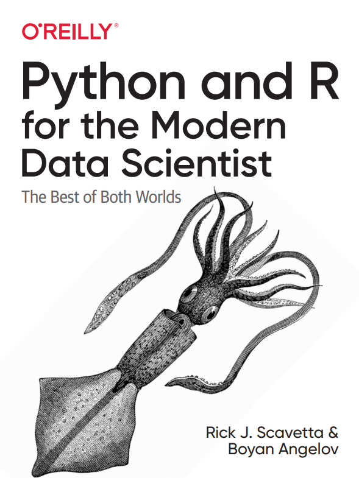

# Python and R for the Modern Data Scientist Code

## Welcome

Welcome to the companion code repository for the O'Reilly book [Python and R for the Modern Data Scientist](https://learning.oreilly.com/library/view/python-and-r/9781492093398/). You can also access this repository as an [RStudio Cloud](https://rstudio.cloud/project/2534578) project (account required). 



Success in data science depends on the flexible and appropriate use of tools. That includes Python and R, two of the foundational programming languages in the field. With this book, data scientists from the Python and R communities will learn how to speak the dialects of each language. By recognizing the strengths of working with both, you'll discover new ways to accomplish data science tasks and expand your skill set.

Authors [Boyan Angelov](https://www.linkedin.com/in/angelovboyan/) and [Rick Scavetta](https://www.linkedin.com/in/rick-scavetta/) explain the parallel structures of these languages and highlight where each one excels, whether it's their linguistic features or the powers of their open source ecosystems. Not only will you learn how to use Python and R together in real-world settings, but you'll also broaden your knowledge and job opportunities by working as a bilingual data scientist.

* Learn Python and R from the perspective of your current language
* Understand the strengths and weaknesses of each language
* Identify use cases where one language is better suited than the other
* Understand the modern open source ecosystem available for both, including packages, frameworks, and workflows
* Learn how to integrate R and Python in a single workflow
* Follow a real-world case study that demonstrates ways to use these languages together

## Repository structure

This repository mirrors the chapter structure in the book. We are not adding the preface and Chapter 1, since they do not contain code.

Part II. Levels of working together I: Bilingual
* [ch02-r-py: R for Pythonistas](ch02)
* [ch03-py-r: Python for R Users](ch03)

Part III. Modern Context
* [ch04-format: Data Format Context](ch04)
* [ch05-workflow: Workflow Context](ch05)

Part IV. Levels of working together II: Synergy

* [ch06-reticulate: Using the two languages synergistically](ch06)
* [ch07-case-study: Case study](ch07)

## Datasets

We use a variety of different datasets in the book. Here you can see how to download them.

### Diamonds

### Plant Growth

## Iris

### Boston housing

This dataset is available in several places, probably the easiest is if you're already using Python to use `scikit-learn`:

```python
from sklearn.datasets import load_boston

boston_data = load_boston()
```

### Amazon music reviews

The amazon music review data can be downloaded from [here](http://jmcauley.ucsd.edu/data/amazon/). In our book we just use the "digital music" subset.

### Swimming pool and car detection

This dataset on swimming pool and car detection using satelite imagery is available on Kaggle [here](https://www.kaggle.com/kbhartiya83/swimming-pool-and-car-detection).

### Daily Australian Temperatures

The daily australian temperatures dataset can be dowloaded directly from Github [here](https://raw.githubusercontent.com/jbrownlee/Datasets/master/daily-min-temperatures.csv).

### Loxodonta Africana species occurence data

This dataset is accesed a bit differently than the other ones in the list. It uses the `sdmbench` R package to obtain the data together with the spatial raster (the bioclimactic varialbes):

```r
library(sdmbench)
data <- get_benchmarking_data("Loxodonta africana")
```

This object is a `list` and contains the occurence data in `data$df_data` and the raster layers in `data$raster_data`.

### Shared cars locations data

These data can be downloaded from Kaggle [here](https://www.kaggle.com/gidutz/autotel-shared-car-locations).

### Wildfires

The wildfires data can be downloaded from Kaggle [here](https://www.kaggle.com/rtatman/188-million-us-wildfires).

### Star Wars

This dataset is built-in into the `dplyr` package:

```r
library(dplyr)
data(starwars)
```
